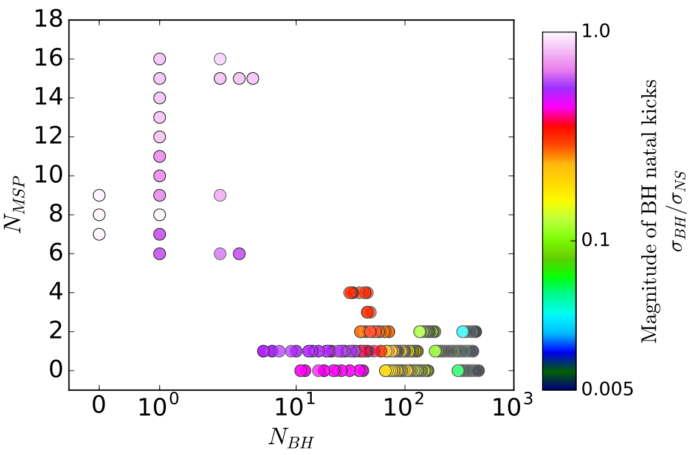
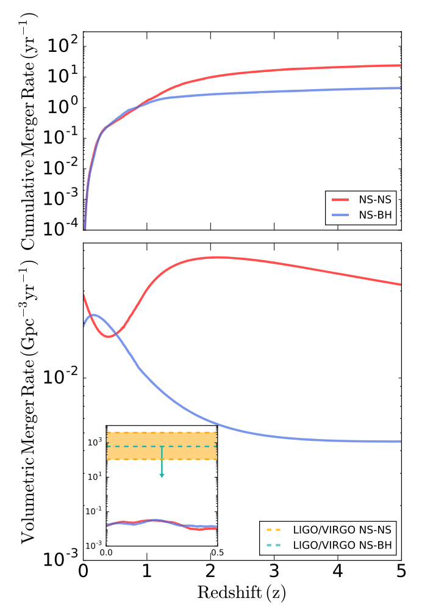
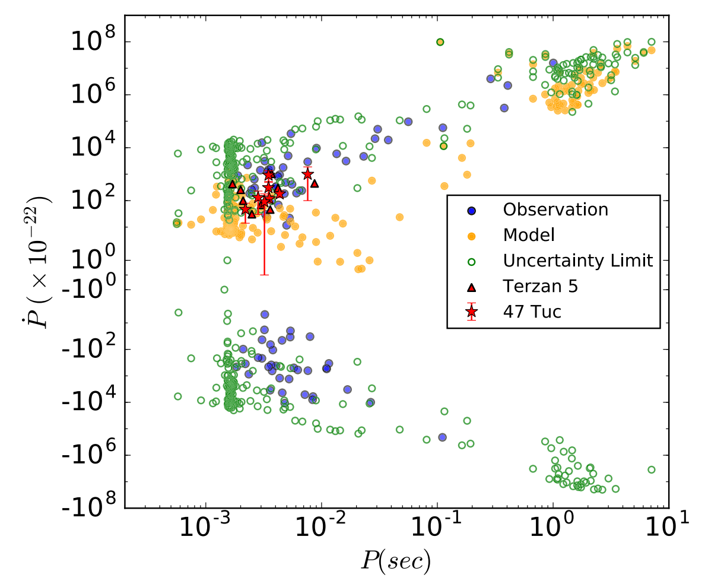

Globular clusters are one of the densest and most dynamically active stellar systems in the Universe. They are groups of ~ 1 million old stars bound together by gravity, constituting spherical systems a hundred thousand times more dense than a typical galaxy. Thanks to this dense environment which leads to frequent gravitational encounters between stars, globular clusters are very efficient in producing exotic objects such as millisecond pulsars, low-mass X-ray binaries and binary black hole mergers.

## Millisecond Pulsar and Black Hole Dynamics
The compact objects (black holes, neutron stars and white dwarf) are dynamically coupled in globular clusters. In this figure I showed the 2-dimentional projections of two cluster simulations. The one on the left contains more than 100 black holes, and the one on the right has one black hole. Through dynamical encounters, a large number of blakc holes can prevent other compact objects (neutron stars in this case) from sliding towards the cluster center, where it is the densest within a globular cluster. This coupling leads to an anti-correlation between the number of millisecond pulsars and number of black holes in globular clusters. 
{: .align-right}{:style="border: 0px solid black; padding: 10px"}

## Neutron Star Binary Mergers
Although globular clusters can produce many exotic objects, the neutron star binary merger rates from globular cluster are very low. 

<!--
{: .align-right}{:style="border: 0px solid black; padding: 10px"}
-->

## Matching Pulsar Observations

<!--
{: .align-right}{:style="border: 0px solid black; padding: 10px"}
-->

<!--
47Tuc.jpeg           bio-photo.jpg        coffee.jpeg          merger_rate.png      ppdot.png
Ye_2019.jpg          cc_noncc_2dproj.png  gc_mass_rcrh.png     nbh_nmsp.png
-->
