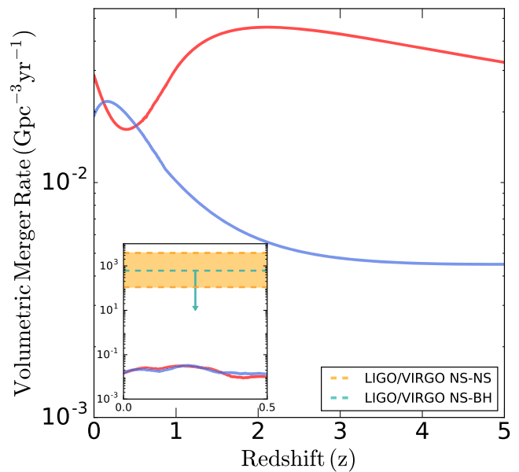

Globular clusters are one of the densest and most dynamically active stellar systems in the Universe. They are groups of ~ 1 million stars bound together by gravity, constituting spherical systems a hundred thousand times more dense than a typical galaxy. Thanks to this dense environment which leads to frequent gravitational encounters between stars, globular clusters are very efficient in producing exotic objects such as millisecond pulsars, low-mass X-ray binaries and binary black hole mergers.

## Neutron Star and Black Hole Dynamics
<!--{: .align-right}{:style="border: 0px solid black; padding: 10px"}{:height="30%" width="30%"}-->
{: .align-right}{:style="border: 0px solid black; padding: 10px"}{:height="50%" width="50%"}
The compact objects (black holes, neutron stars and white dwarfs) in globular clusters are dynamically coupled. Due to mass segregation, black holes dominate the core of many globular clusters. Gravitational encounters within black holes and between black holes and other stars have significant effects on the evolution of other compact objects and their host clusters. In the figure below I show 2-dimentional projections of two typical globular clusters from simulations. The one on the left contains more than 100 black holes, and the one on the right has only one black hole. We can see that the positions of the neutron stars related to the center of their host clusters depend on the number/mass of black holes in the clusters. This coupling leads to many interesting results such as the anti-correlation between the numbers of millisecond pulsars and black holes in globular clusters <a href="https://ui.adsabs.harvard.edu/abs/2019ApJ...877..122Y/abstract">(Ye+2019)</a>, and the low merger rate of double neutron star and neutron star-black hole binaries from globular clusters <a href="https://ui.adsabs.harvard.edu/abs/2020ApJ...888L..10Y/abstract">(Ye+2020)</a>.
<!---->
<!---->
<!--
{: .align-right}{:style="border: 0px solid black; padding: 10px"}
-->

## Compact Objects in the Globular Cluster 47 Tucanae
{: .align-left}{:style="border: 0px solid black; padding: 10px"}{:height="25%" width="25%"}
47 Tucanae is one of the most massive and densest globular clusters in the Milky Way and is very computationally challenging to simulate. Observations have shown that this cluster contains large populations of compact objects, so it is one of the best observational target to study globular cluster dynamics and compact object evolution. I show that by using the Cluster Monte Carlo code, I was able to achieve a best-fit 47 Tuc model that matches various observations simultaneously, including the surface brightness profile,  the velocity dispersion profile, pulsar accelerations, and the number of different types of compact objects <a href="https://ui.adsabs.harvard.edu/abs/2021arXiv211005495Y/abstract">(Ye+2021)</a>. 
    
<!--&emsp;  (4 x &nbsp;)-->

## Millisecond Pulsars in Globular Clusters
{: .align-right}{:style="border: 0px solid black; padding: 10px"}{:height="30%" width="30%"}
It is well known that globular clusters produce millisecond pulsars at a specific abundance 10 times larger than the Galactic field due to the high density and large stellar encounter rate of the cluster environment. However, the high uncertainty of pulsar formation and evolution, and the chaotic dynamical environment of globular clusters make it especially challenging to model pulsars in globular clusters. Using Monte Carlo N-body cluster simulations, I showed that dynamical interactions greatly enhance millisecond pulsar formation in globular clusters, and pulsars are spun-up to millisecond periods through extended periods of mass trasfer in binaries. The spin periods and spin-dwon rates (which can be used to derive dipole magnetic fields) of simulated pulsars largely match the observed pulsars in globular clusters shown in the figure on the left <a href="https://ui.adsabs.harvard.edu/abs/2019ApJ...877..122Y/abstract">(Ye+2019)</a>.  

<!--
47Tuc.jpeg           bio-photo.jpg        coffee.jpeg          merger_rate.png      ppdot.png
Ye_2019.jpg          cc_noncc_2dproj.png  gc_mass_rcrh.png     nbh_nmsp.png         psr_al.png
-->
